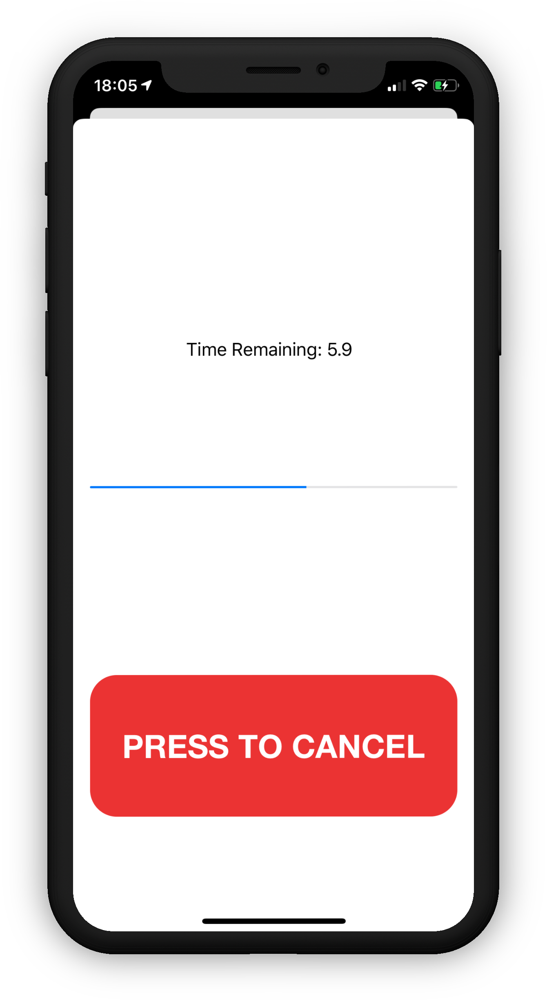
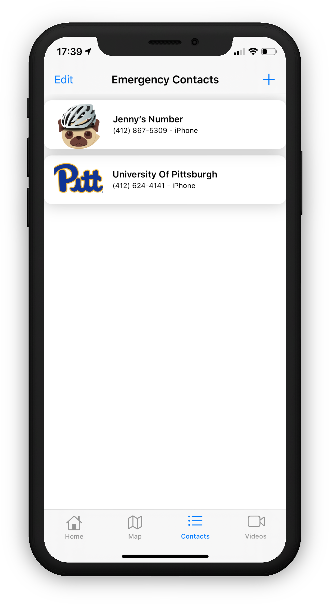
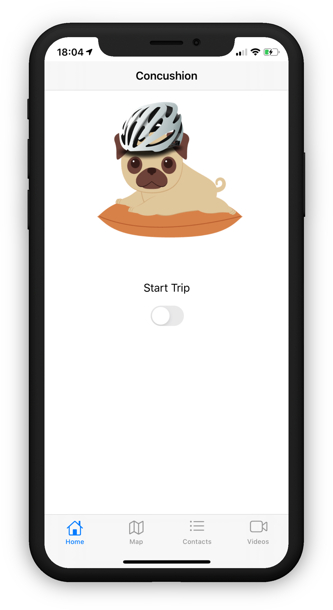
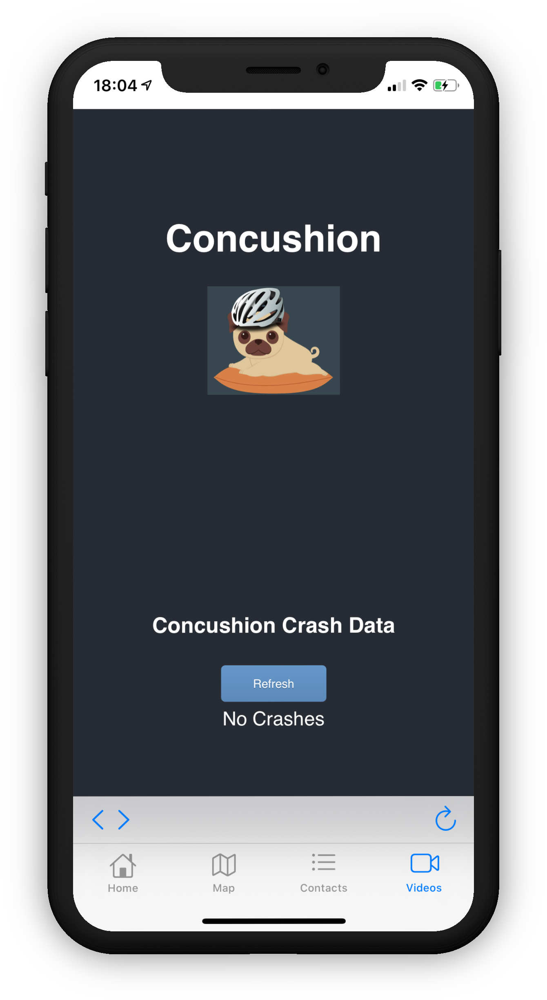

# Concushion iOS App

This application was made with a group of 5 students for the course ECE 1896 - Senior Design Project at the University of Pittsburgh

### Functionalities 

This application works in conjunction with our Concushion smart bicycle helmet product which does the following:
- Sends signals to the onboard raspberry pi controller
- Displays and keeps track of user location
- Has a customizable contact list
- Has a 10 second countdown timer after a collision is detected from the helmet
- Sends an emergency text message with user's last known location to an emergency contact
- Has the ability to view crash footage from the onboard camera

#### Countdown Timer

#### Emergency Contact List

#### Start a Bicycling Trip

#### Viewing Crash Footage

